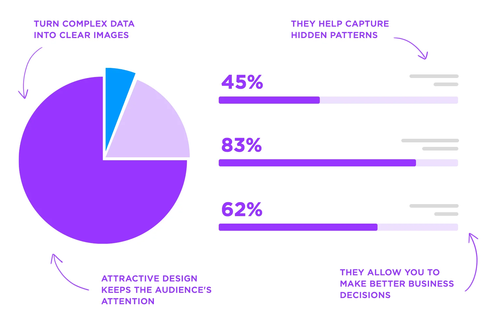
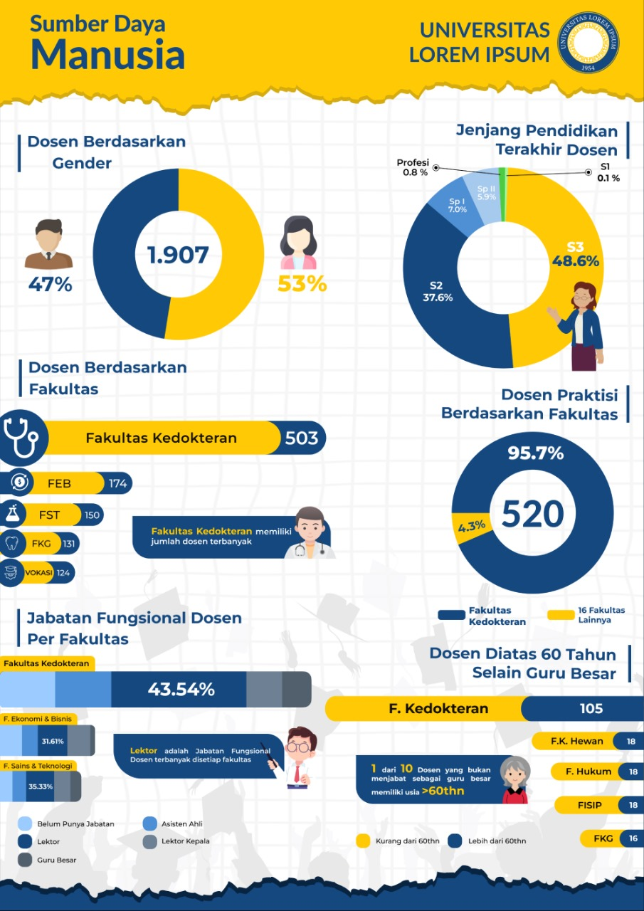
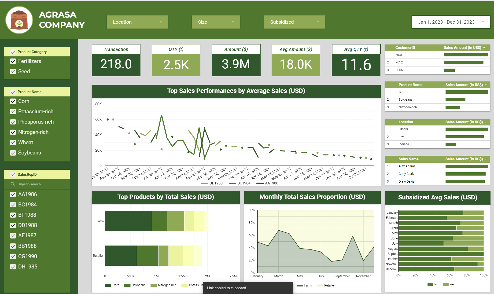
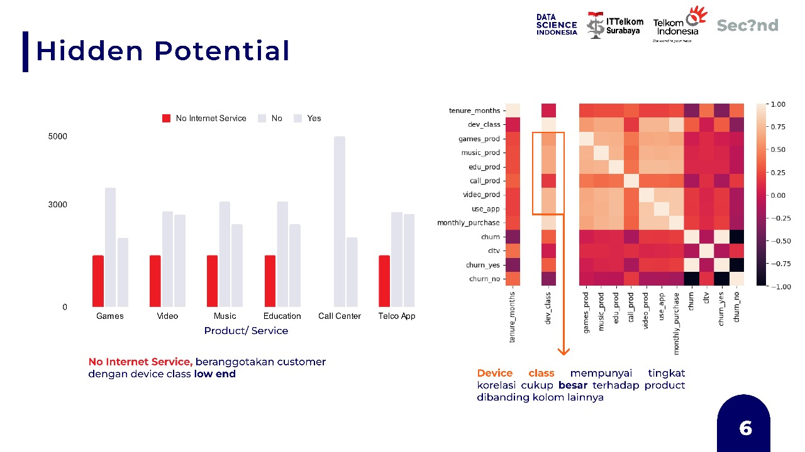

# **Crafting Data Narratives: Menguasai Visualisasi dan Storytelling**

## **Mengapa Visualisasi Data Penting?**

Visualisasi data merupakan alat penting untuk menyederhanakan informasi kompleks, meningkatkan pemahaman, serta mendukung pengambilan keputusan strategis.  
> **"Good data visualization turns numbers into action."**

  

📊 **Manfaat Utama Visualisasi Data**:
1. **Mempercepat Pemahaman:** Grafik mempermudah analisis dibandingkan tabel angka mentah.  
2. **Mendukung Keputusan Cepat:** Insight yang jelas memungkinkan eksekutif untuk mengambil tindakan strategis secara lebih efisien.  
3. **Mengomunikasikan Data dengan Efektif:** Visualisasi yang menarik meningkatkan perhatian dan keterlibatan audiens.  

  

---

## **Prinsip-Prinsip Visualisasi Data yang Efektif**

### **1. Kenali Audiens**
Memahami kebutuhan audiens adalah langkah awal dalam menyusun visualisasi data yang efektif.  
- **Eksekutif:** Fokus pada `KPI utama` dan *summary* data.  
- **Tim Operasional:** Berikan detail teknis dan opsi untuk menggali data lebih mendalam.

  

📌 **Contoh:**  
Dashboard eksekutif hanya menampilkan *ringkasan*, sementara dashboard untuk tim operasional mencakup fitur *filter* untuk analisis lebih lanjut.

---

### **2. Pilih Grafik yang Tepat**
Pemilihan jenis grafik sangat penting untuk menyampaikan data dengan jelas.  

🔹 **Jenis Grafik dan Fungsinya**:
- **Bar Chart:** Membandingkan kategori.  
- **Line Chart:** Melacak tren dari waktu ke waktu.  
- **Pie Chart:** Menggambarkan proporsi total (gunakan dengan hati-hati).  
- **Heatmap:** Menunjukkan distribusi atau intensitas data.  

> 💡 **Tip Praktis:** Jika ragu, gunakan `Bar Chart`, karena grafik ini universal dan mudah dipahami.

  

---

### **3. Jaga Kesederhanaan (Keep It Simple)**
Visualisasi data harus fokus pada pesan utama dan menghindari elemen-elemen yang tidak relevan.  
> **"Clarity is king."**

🎯 **Panduan:**  
- Hindari dekorasi visual yang tidak perlu.  
- Pastikan grafik memiliki struktur yang logis dan mudah diikuti.  

  

---

### **4. Gunakan Warna dengan Bijak**
Warna adalah alat penting untuk menyampaikan pesan, tetapi harus digunakan secara tepat.  

✅ **Yang Harus Dilakukan**:  
- **Utamakan Kontras:** Pastikan elemen visual mudah dibaca.  
- **Highlight Insight Utama:** Gunakan warna cerah untuk menarik perhatian pada poin penting.  

❌ **Hindari**:
- Menggunakan terlalu banyak warna (*rainbow effect*).  
- Kombinasi warna yang sulit dibaca oleh pengguna dengan buta warna.

  

---

### **5. Pastikan Ketepatan Data**
Kualitas visualisasi data sangat bergantung pada akurasi dan representasi data yang tepat.  

📌 **Prinsip Utama**:
- Gunakan skala yang konsisten untuk semua grafik.  
- Hindari manipulasi visual, seperti memotong skala atau memperbesar elemen tertentu secara berlebihan.  

---

## **Mengintegrasikan Storytelling dalam Visualisasi**

  

Storytelling dalam data adalah seni dan ilmu menyampaikan informasi melalui narasi yang terstruktur, relevan, dan menarik.  

---

### **Empat Pilar Utama Data Storytelling**

1️⃣ **Visual Design**  
**Definisi:** Cara menyajikan data secara visual untuk menarik perhatian dan mempermudah pemahaman.  
- **Simplicity:** Hindari desain berlebihan.  
- **Consistency:** Gunakan gaya desain yang seragam.  
- **Readability:** Pastikan elemen visual mudah dibaca.  

📊 **Contoh:**  
Gunakan `Bar Chart` untuk perbandingan, bukan grafik 3D yang sulit dipahami.

---

2️⃣ **Data**  
**Definisi:** Data adalah inti dari storytelling. Narasi kehilangan makna jika data yang disajikan tidak relevan atau valid.  
- **Accuracy:** Pastikan data bersih dan valid.  
- **Clarity:** Fokus pada data yang mendukung pesan utama.  
- **Insight-Driven:** Sajikan insight yang memberikan nilai tambah.  

📌 **Contoh:**  
Alih-alih menampilkan semua data penjualan, fokuslah pada wilayah dengan kinerja tertinggi atau terendah.

---

3️⃣ **Context for Communication**  
**Definisi:** Konteks memberikan makna pada data dan menjawab mengapa data tersebut penting bagi audiens.  
- **Kenali Audiens:** Apakah target audiens Anda adalah eksekutif, analis, atau masyarakat umum?  
- **Tentukan Tujuan:** Apakah untuk menginformasikan, meyakinkan, atau mendorong tindakan?  
- **Relevansi:** Hubungkan data dengan kebutuhan atau masalah audiens.  

📊 **Contoh:**  
Ketika menyampaikan laporan kepada manajer, fokus pada kinerja terhadap target, bukan detail teknis.

---

4️⃣ **Narrative**  
**Definisi:** Narasi mengubah data menjadi cerita yang terstruktur dan menarik.  
- **Structure:**  
  1. **Awal:** Perkenalkan masalah atau pertanyaan utama.  
  2. **Tengah:** Tunjukkan data yang relevan.  
  3. **Akhir:** Sampaikan kesimpulan atau rekomendasi.  
- **Engagement:** Gunakan elemen emosional atau relevansi personal untuk menarik perhatian.  
- **Call to Action:** Akhiri dengan langkah nyata berdasarkan data.  

📌 **Contoh Narasi:**  
- **Awal:** "Penjualan turun 15% bulan ini."  
- **Tengah:** "Data menunjukkan wilayah X menyumbang 50% dari penurunan."  
- **Akhir:** "Lakukan promosi khusus di wilayah X untuk meningkatkan penjualan."

---

## **Mengintegrasikan Keempat Pilar**

💡 **Panduan Praktis**:
1. **Tentukan Tujuan:** Apa yang ingin dicapai dengan visualisasi ini?  
2. **Analisis Data:** Pastikan data yang digunakan relevan dan valid.  
3. **Desain Visualisasi:** Pilih grafik yang sesuai dengan audiens dan tujuan.  
4. **Rangkai Narasi:** Susun cerita yang menjelaskan data dalam konteks yang bermakna.  
5. **Uji Audiens:** Pastikan pesan tersampaikan dengan jelas. Jika tidak, revisi sesuai kebutuhan.

---

Dengan mengaplikasikan prinsip dan pilar di atas, visualisasi data tidak hanya menjadi alat analisis, tetapi juga menjadi media komunikasi yang memengaruhi keputusan dan menghasilkan aksi. 🚀

---

## **Contoh Karya**
### **Infografis**
  

### **Dashboard**
  
Link: https://lookerstudio.google.com/reporting/4c6ef844-8738-4a02-8854-d74f2bdb5a97

### **Story Telling**
 **Hidden Potential: Memaksimalkan Wawasan dari Data Pelanggan**

  
---

**Narasi untuk Slide**

**Pembukaan**
"Baik, pada slide ini kita akan membahas potensi tersembunyi yang bisa kita identifikasi dari data pelanggan, khususnya terkait pola penggunaan layanan dan perangkat pelanggan."

---

**Penjelasan Bar Chart**
"Pertama, mari kita lihat grafik di sebelah kiri. Grafik ini menunjukkan jumlah pelanggan yang menggunakan berbagai jenis produk atau layanan, seperti Games, Video, Music, Education, Call Center, dan Telco App.  
Kita bisa melihat adanya kelompok pelanggan yang masuk dalam kategori *No Internet Service*, yang ditunjukkan dengan batang berwarna merah. Data ini menunjukkan bahwa pelanggan yang tidak menggunakan layanan internet cenderung berasal dari kelompok **device class low-end**.  
Ini penting karena pelanggan dengan perangkat kelas rendah mungkin memiliki keterbatasan akses ke layanan tertentu, dan ini membuka peluang bagi kita untuk menciptakan solusi yang lebih terjangkau dan relevan untuk mereka."

---

**Penjelasan Heatmap**
"Berikutnya, kita lihat visualisasi heatmap di sebelah kanan. Heatmap ini memberikan wawasan tentang hubungan antar variabel dalam data pelanggan kita.  
Satu temuan penting di sini adalah bahwa **device class** memiliki korelasi yang cukup tinggi dengan penggunaan kategori produk. Artinya, jenis perangkat yang digunakan pelanggan secara signifikan memengaruhi pilihan produk atau layanan mereka.  
Misalnya, pelanggan dengan perangkat low-end mungkin lebih cenderung menggunakan layanan tertentu dibandingkan yang lain."

---

**Insight Utama**
"Dari kedua visualisasi ini, kita bisa menyimpulkan bahwa perangkat pelanggan, khususnya device class, menjadi faktor penting yang memengaruhi akses dan preferensi layanan.  
Hal ini membuka peluang besar bagi kita untuk mengembangkan strategi berbasis segmentasi perangkat, seperti menargetkan pengguna perangkat low-end dengan produk atau paket layanan yang disesuaikan."

---

**Rekomendasi Strategi**
"Berdasarkan analisis ini, ada beberapa langkah strategis yang bisa kita ambil:  
1. **Segmentasi Pelanggan:** Fokuskan upaya pemasaran dan promosi pada pelanggan dengan perangkat kelas rendah untuk meningkatkan adopsi layanan.  
2. **Pengembangan Produk:** Optimalkan pengalaman pengguna untuk layanan yang bisa diakses oleh perangkat dengan spesifikasi rendah.  
3. **Strategi Personalisasi:** Manfaatkan hubungan antar variabel, seperti yang ditunjukkan oleh heatmap, untuk menciptakan kampanye pemasaran yang lebih relevan dan efektif."

---

**Penutup**
"Slide ini memberikan kita gambaran tentang pentingnya memahami keterkaitan antara perangkat pelanggan dan pola penggunaan layanan. Dengan mengoptimalkan temuan ini, kita bisa membuka peluang besar untuk meningkatkan penetrasi layanan dan memperkuat loyalitas pelanggan."

---
